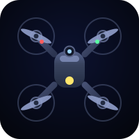

<p align="center">
  
</p>

<h1 align="center">DRONE·I·FY</h1>

<p align="center"><b>Type a scenario. Launch a drone show.</b></p>

<p align="center">
Describe any moment in plain words — <i>"a dragon flies over a castle and breathes fire"</i>,<br/>
<i>"usa wins the world cup and the sky celebrates"</i> — and watch a fleet of 600 drones perform it<br/>
over a night city: liftoff from the launch pad, scene after scene in the sky, and a landing when the story ends.
</p>

---

## What it does

- **Any scenario becomes a show** — creatures, flags, celebrations, love stories, epics. Nouns become formations, verbs become flight, celebrations get their fireworks.
- **Characters, drawn for you** — heroes and creatures arrive as solid, color-blocked figures sculpted in 3D, posed like keyframes act after act.
- **Real drone shows, faithfully** — the fleet waits on the pad with breathing standby lights, lifts off in waves, morphs deliberately between scenes, holds each image until it has fully formed, and returns to land.
- **True flight physics** — speed and thrust limits, synchronized formation moves, gusts of wind, and drones that hold station like the real thing. Every aircraft is visible: rotors, body, belly light.
- **Rich imagery** — glowing wireframe contours, full-color pixel-painted pictures (flags wave in their true colors), rotating 3D solids, pyrotechnics pouring off formations.
- **Every show is a link** — hit SHARE and send it; the show replays for anyone who opens it.

## Run it

```bash
npm install
node dev.mjs
# → http://localhost:8124
```

Copy `.env.example` to `.env` and add your API key for the full experience.
Without a key the show still flies using the built-in scenario interpreter.

